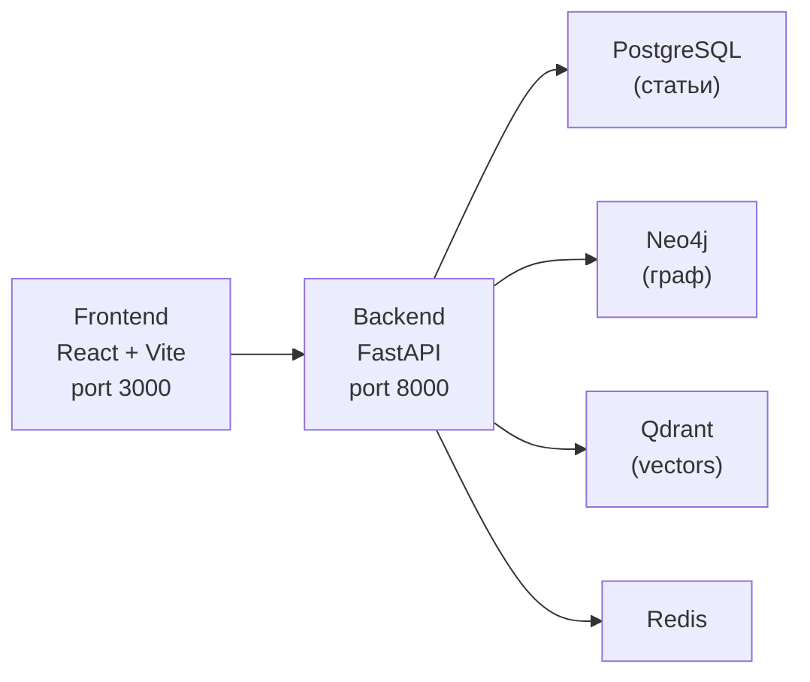

# IT News Platform

Платформа для сбора, анализа и визуализации IT-новостей с графом знаний, семантическим поиском и RAG-ответами.

## Архитектура



## Реализовано

### Backend (фазы 1-5)
- **Ingestion**: RSS (TechCrunch, Wired, Ars Technica) + NewsAPI, очистка HTML, нормализация, language detection, дедупликация
- **NLP/Graph**: rule-based NER, relation extraction, граф сущностей в Neo4j
- **Embeddings**: `paraphrase-multilingual-MiniLM-L12-v2`, Qdrant vector store
- **Clustering**: HDBSCAN с fallback на KMeans
- **RAG**: Groq LLM с 3-model fallback chain + retrieval-only degradation

### Frontend (фаза 6)
- **Dashboard**: граф сущностей, список статей, кластеры
- **RAG Chat**: чат-интерфейс для вопросов по новостям
- **Граф**: интерактивная визуализация сущностей (Cytoscape.js)
- **Стартовый обзор графа**: при открытии dashboard показываются самые связанные сущности
- **Подписи связей**: рёбра графа отображают тип связи между сущностями
- **Фильтры**: по дате, источнику, языку, кластеру
- **Детальные страницы**: статья, сущность, кластер
- **Responsive**: адаптивный layout для desktop и mobile

## Быстрый старт

### Требования
- Docker и Docker Compose
- 4 GB+ RAM (для embedding модели)

### Запуск

```bash
# 1. Клонировать репозиторий
git clone https://github.com/ArtemChik103/ITnews.git
cd ITnews

# 2. Настроить переменные окружения
cp .env.example .env
# Отредактировать .env: добавить GROQ_API_KEY (обязательно), NEWS_API_KEY (опционально)

# 3. Запустить все сервисы
docker compose up --build

# 4. Открыть UI
# Frontend: http://localhost:3000
# Backend API: http://localhost:8000/health
```

### Загрузка тестовых данных

После запуска всех сервисов:

```bash
# Запустить ingestion (сбор новостей)
curl -X POST http://localhost:8000/ingestion/run

# Запустить indexing (генерация embeddings)
curl -X POST http://localhost:8000/indexing/run

# Запустить clustering
curl -X POST http://localhost:8000/clustering/run

# Обработать граф для первых статей
curl -X POST http://localhost:8000/articles/1/graph
curl -X POST http://localhost:8000/articles/2/graph
curl -X POST http://localhost:8000/articles/3/graph
```

Планировщик автоматически выполняет ingestion (каждые 30 мин), indexing (каждые 5 мин) и clustering (каждые 30 мин).

## Переменные окружения

| Переменная | По умолчанию | Описание |
|---|---|---|
| `GROQ_API_KEY` | — | **Обязательно.** API ключ для Groq LLM |
| `NEWS_API_KEY` | — | API ключ для NewsAPI (опционально) |
| `ENABLE_NEWS_API` | `false` | Включить сбор через NewsAPI |
| `BACKEND_PORT` | `8000` | Порт backend API |
| `FRONTEND_PORT` | `3000` | Порт frontend UI |
| `POSTGRES_PASSWORD` | `itnews` | Пароль PostgreSQL |
| `NEO4J_PASSWORD` | `please-change-me` | Пароль Neo4j |

Полный список переменных — в `.env.example`.

## API Endpoints

### Публичные (используются frontend)

| Метод | Путь | Описание |
|---|---|---|
| `GET` | `/api/articles` | Список статей с пагинацией и фильтрами |
| `GET` | `/api/articles/{id}` | Детали статьи с сущностями |
| `GET` | `/api/graph` | Граф сущностей (по статье/сущности/запросу) |
| `GET` | `/api/entities/{name}` | Детали сущности |
| `GET` | `/api/clusters` | Список кластеров |
| `POST` | `/api/search` | RAG поиск (вопрос → ответ + источники) |
| `GET` | `/api/search/semantic` | Семантический поиск по статьям |

### Служебные

| Метод | Путь | Описание |
|---|---|---|
| `GET` | `/health` | Healthcheck всех сервисов |
| `POST` | `/ingestion/run` | Запуск сбора новостей |
| `POST` | `/indexing/run` | Генерация embeddings |
| `POST` | `/clustering/run` | Перекластеризация |
| `POST` | `/articles/{id}/graph` | NER + граф для статьи |

## Структура проекта

```
├── frontend/           # React + TypeScript + Vite
│   └── src/
│       ├── api/        # Axios API client
│       ├── components/ # UI компоненты
│       ├── pages/      # Страницы (Dashboard, Article, Entity, Cluster)
│       ├── store/      # Zustand state management
│       └── types/      # TypeScript типы
├── backend/            # FastAPI + Python
│   └── app/
│       ├── api/        # Маршруты
│       ├── models/     # SQLAlchemy модели
│       ├── schemas/    # Pydantic схемы
│       └── services/   # Бизнес-логика
├── docker/             # Dockerfiles и nginx конфиг
├── docs/               # Документация фаз
└── docker-compose.yml  # Оркестрация всех сервисов
```

## Demo Runbook

### Сценарий 1: Семантический поиск
1. Открыть http://localhost:3000
2. В чате ввести: «Какие компании работают с искусственным интеллектом?»
3. Посмотреть ответ, источники и граф

### Сценарий 2: Навигация по графу
1. На dashboard изучить стартовый граф с наиболее связанными сущностями
2. Кликнуть по узлу в графе
3. Посмотреть подписи рёбер и связанные сущности
4. Перейти к детальной странице статьи

### Сценарий 3: Фильтрация
1. Выбрать источник в фильтрах
2. Установить диапазон дат
3. Убедиться, что список статей обновился

### Восстановление при сбое
- Если LLM не отвечает: система автоматически переключается на fallback модель или retrieval-only режим
- Если граф пуст: выполнить `POST /articles/{id}/graph` для нужных статей
- Если нет статей: выполнить `POST /ingestion/run`

## Облачный деплой (опционально)

Документация для альтернативного облачного развёртывания:

| Компонент | Сервис |
|---|---|
| Frontend | Vercel (из `frontend/`) |
| Backend | Render или Railway |
| PostgreSQL | Supabase или managed Postgres |
| Neo4j | Neo4j Aura |
| Qdrant | Qdrant Cloud |

Для облачного деплоя: установить `VITE_API_URL` в переменных окружения frontend на URL backend.

## Известные ограничения

- NER и relation extraction — rule-based, baseline-качество
- Clustering может быть нестабилен на маленьком датасете (< 50 статей)
- Качество RAG ответов зависит от качества ingestion и graph extraction
- Groq free-tier лимиты могут вызывать деградацию (rate limiting)
- Embedding модель загружается в RAM (~500 MB), что увеличивает время старта
- Миграции БД через `ALTER TABLE IF NOT EXISTS` (не Alembic)
- Планировщик встроен в backend; при масштабировании нужен отдельный worker
- Макс. 50 узлов и 80 связей в одном graph payload
