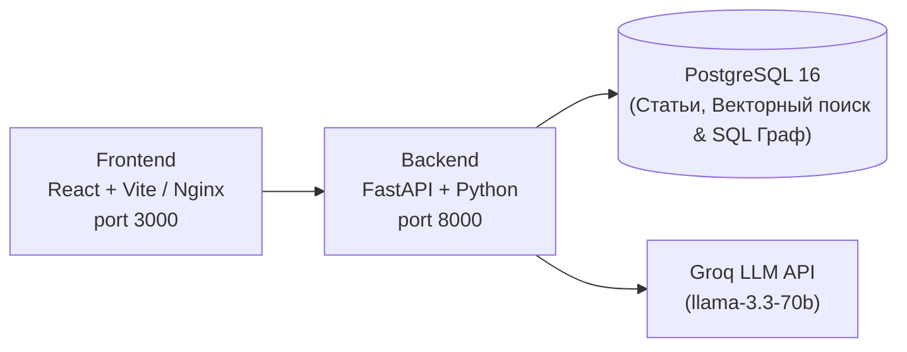

# IT News Platform

Ультралегковесная платформа для автоматического сбора, анализа и визуализации IT-новостей на русском и английском языках с графом знаний, векторным семантическим поиском и RAG-ответами на базе ИИ.

 **Live Demo**: [https://itnews-app.onrender.com](https://itnews-app.onrender.com)

---

## Архитектура

Архитектура оптимизирована для **100% бесплатного 24/7 развёртывания** в облаке (потребление памяти **менее 400 МБ RAM**):


```mermaid
flowchart LR
    FE["Frontend<br/>React + Vite / Nginx<br/>port 3000"] --> BE["Backend<br/>FastAPI + Python<br/>port 8000"]
    BE --> PG[("PostgreSQL 16<br/>(Статьи, Векторный поиск & SQL Граф)")]
    BE --> GROQ["Groq LLM API<br/>(llama-3.3-70b)"]
```

---

## Особенности и возможности

- **Многоязычный авто-сбор новостей (RU + EN)**:
  - **Хабр (Habr.com)**, **3DNews.ru**, **OpenNET.ru**, **CNews.ru**
  - **TechCrunch**, **Ars Technica**, **The Verge**, **Wired**
- **Full Web Scraping**: Автоматический выкач полного текста статей с очисткой мусора и рекламы.
- **Анти-спам фильтр**: Автоматическая блокировка рекламных купонов и промокодов (*Valvoline*, *Paramount+ Deals*, etc.).
- **Векторный семантический поиск**: Локальная эмбеддинг-модель`all-MiniLM-L6-v2` (FastEmbed/ONNX) с мгновенным поиском по PostgreSQL.
- **Интерактивный граф знаний**: Извлечение IT-сущностей (*Google*, *Apple*, *OpenAI*, *Sam Altman*) и их связей с визуализацией на Cytoscape.js.
- **RAG Чат (ИИ)**: Интеллектуальный поиск и ответы на базе **Groq LLM (`llama-3.3-70b-versatile`)** со ссылками на первоисточники без лишнего мусора в разметке.
- **Автоматический сбор 24/7**: Встроенный планировщик обновляет новости и граф каждые 15 минут.

---

## 1-Click Облачный деплой (100% Бесплатно)

Проект полностью готов к деплою на **Render.com** в 1 клик без необходимости настраивать VPS или платить за серверы:

1. Зарегистрируйтесь на **[Render.com](https://render.com)** через ваш аккаунт **GitHub**.
2. Нажмите **`New +`** **`Blueprint`**.
3. Подключите ваш репозиторий`ITnews`.
4. Задайте переменную`GROQ_API_KEY` (ваш ключ Groq API).
5. Нажмите **`Apply`**. Сервис сам развернёт PostgreSQL и веб-приложение с готовой HTTPS ссылкой!

---

## Локальный запуск (Docker Compose)

### Требования
- Docker и Docker Compose (минимум 1 ГБ свободной RAM).

### Запуск одной командой:

```bash
# 1. Клонировать репозиторий
git clone https://github.com/ArtemChik103/ITnews.git
cd ITnews

# 2. Создать .env файл
cp .env.example .env
# Укажите ваш GROQ_API_KEY в .env

# 3. Запустить контейнеры
docker compose up --build -d

# 4. Открыть UI
# Frontend: http://localhost:3000
# Backend API: http://localhost:8000/health
```

### Первичный запуск парсинга новостей вручную:
```bash
curl -X POST http://localhost:8000/ingestion/run
```

---

## Переменные окружения

| Переменная | Описание |
|---|---|
|`GROQ_API_KEY` | **Обязательно.** API-ключ для Groq LLM (например,`gsk_...`) |
|`GROQ_MODEL_PRIMARY` | Основная модель ИИ (`llama-3.3-70b-versatile`) |
|`GROQ_MODEL_FALLBACK` | Резервная модель ИИ (`llama-3.1-8b-instant`) |
|`ALLOWED_RSS_SOURCES` | Список RSS-источников новостейчерез запятую |
|`POSTGRES_DB` | Имя базы данных PostgreSQL (`itnews`) |
|`POSTGRES_USER` | Пользователь PostgreSQL (`itnews`) |
|`POSTGRES_PASSWORD` | Пароль к базе данных PostgreSQL |

---

## Публичные API Endpoints

| Метод | Эндпоинт | Описание |
|---|---|---|
|`GET` |`/api/articles` | Список статей с пагинацией и фильтрами |
|`GET` |`/api/articles/{id}` | Детали статьи и её графовые сущности |
|`GET` |`/api/graph` | Интерактивный граф знаний |
|`GET` |`/api/clusters` | Кластеры похожих новостей |
|`POST` |`/api/search` | RAG Поиск (Вопрос Ответ ИИ + Источники) |
|`GET` |`/api/search/semantic` | Семантический поиск по векторам |
|`POST` |`/ingestion/run` | Ручной запуск сбора новостей |

---

## Структура проекта

```
├── frontend/ # React + TypeScript + Vite + MUI
│ └── src/
│ ├── components/ # Граф, RAG-чат, список новостей
│ ├── pages/ # Dashboard, Article, Entity views
│ └── store/ # Zustand состояние
├── backend/ # FastAPI + SQLAlchemy
│ └── app/
│ ├── api/ # Маршруты API
│ ├── models/ # Модели PostgreSQL
│ └── services/ # RAG, Web Scraper, NER, Vector Store
├── docker/ # Dockerfile & Nginx конфиги
├── render.yaml # Конфигурация для 1-click деплоя на Render.com
└── docker-compose.yml # Локальная оркестрация контейнеров
```
